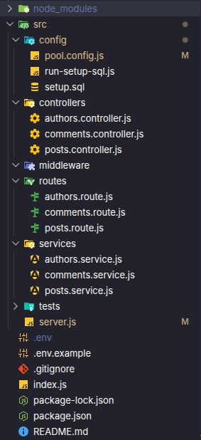

# Documentación detallada uso AI

## 1. setup.sql

### 1.1 Prompt
setup.sql no esta todavia montado:

```sql
-- Tabla authors
CREATE TABLE IF NOT EXISTS authors (
    id SERIAL PRIMARY KEY,
    name VARCHAR(100) NOT NULL,
    email VARCHAR(150) UNIQUE NOT NULL,
    bio TEXT,
    created_at TIMESTAMPTZ DEFAULT NOW()
);

-- Tabla posts
CREATE TABLE IF NOT EXISTS posts (
    id SERIAL PRIMARY KEY,
    title VARCHAR(200) NOT NULL,
    content TEXT NOT NULL,
    author_id INTEGER NOT NULL,
    published BOOLEAN DEFAULT FALSE,
    created_at TIMESTAMPTZ DEFAULT NOW(),
    FOREIGN KEY (author_id) REFERENCES authors(id) ON DELETE CASCADE
);

-- Tabla comments (extra credit)
CREATE TABLE IF NOT EXISTS comments (
    id SERIAL PRIMARY KEY,
    post_id INTEGER NOT NULL,
    author_id INTEGER NOT NULL,
    content TEXT NOT NULL,
    created_at TIMESTAMPTZ DEFAULT NOW(),
    FOREIGN KEY (post_id) REFERENCES posts(id) ON DELETE CASCADE,
    FOREIGN KEY (author_id) REFERENCES authors(id) ON DELETE CASCADE
);
```

Este es lo que está adentro del setup.sql. Quiero poder ejecutarlo desde un script con un archivo .js para facilitarme el trabajo. Es posible, cómo?

Por otro lado te paso la configuración de pool.config.js para que tengas a la mano y una foto de como tengo estructuradas las carpetas:



```js
import { Pool } from 'pg';
import { loadEnvFile } from 'node:process';
process.loadEnvFile('.env');

const configPool = {
    host: process.env.DB_HOST,
    port: process.env.DB_PORT,
    database: process.env.DB_NAME,
    user: process.env.DB_USER,
    password: process.env.DB_PASSWORD,
    max: process.env.DB_MAX,
    idleTimeoutMillis: process.env.DB_IDLE_TIMEOUT_MILLIS,
    connectionTimeoutMillis: process.env.DB_CONNECTION_TIMEOUT_MILLIS
};

export const pool = new Pool(configPool);
```


### 1.2 Output

Perfecto, ese `setup.sql` está bien — vamos a armar el script que lo ejecute, adaptado a tu estructura real (`pool.config.js` con export nombrado `pool`, y el `.sql` viviendo en `src/config/`).

#### src/config/run-setup.js

```js
import { readFileSync } from 'node:fs';
import { pool } from './pool.config.js';

const sql = readFileSync(new URL('./setup.sql', import.meta.url), 'utf-8');

try {
  await pool.query(sql);
  console.log('Tablas creadas correctamente');
} catch (error) {
  console.error('Error ejecutando setup.sql:', error.message);
} finally {
  await pool.end();
}
```

Detalle importante que cambia respecto al ejemplo genérico que te había mostrado antes: este archivo va a vivir **dentro** de `src/config/`, junto a `pool.config.js` y `setup.sql`. Por eso:

- `import { pool } from './pool.config.js'`: ruta relativa **al mismo directorio** (`./`), no `../config/...` como en el service — porque este script está adentro de `config/`, no afuera.
- `new URL('./setup.sql', import.meta.url)`: mismo criterio, `setup.sql` está al lado de este archivo.
- Fijate que uso `await` "suelto" (sin envolverlo en una función `async`) directamente en el nivel superior del archivo. Esto se llama **top-level await**, y es una característica de los ES Modules (por eso tu `package.json` necesita `"type": "module"`, que ya debe tener si estás usando `import`/`export` en todos lados). Sin eso, tendrías que envolver todo en una función `async` y llamarla, como en mi primer ejemplo.

#### Cómo correrlo

Con Node, simplemente:

```bash
node src/config/run-setup.js
```

Si querés, después le agregás un script en `package.json` (`"db:setup": "node src/config/run-setup.js"`) para no acordarte de la ruta cada vez, pero no es obligatorio ahora.